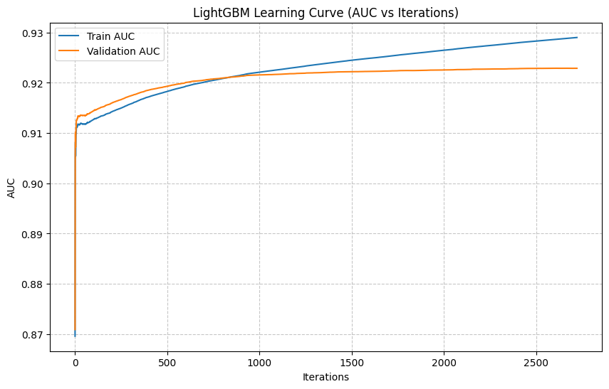

# Loan Repayment Prediction using Ensemble Learning

This project predicts whether a borrower will **repay their loan** or **default**, using advanced machine learning techniques.  
The main goal is to build a **highly generalizable model** evaluated using **Area Under the ROC Curve (AUC)**.

---

## Project Overview

The dataset contains financial and demographic information about borrowers.  
The objective is to predict the likelihood of loan repayment (`loan_paid_back`) based on income, debt ratio, credit score, and other borrower attributes.

This project explores multiple machine learning models and ultimately identifies **LightGBM** as the best-performing model after extensive comparison and validation.

---

## Dataset Description

**Columns Overview:**

| Type | Columns |
|------|----------|
| Numerical | `annual_income`, `debt_to_income_ratio`, `credit_score`, `loan_amount`, `interest_rate` |
| Categorical | `gender`, `marital_status`, `education_level`, `employment_status`, `loan_purpose`, `grade_subgrade` |
| Target | `loan_paid_back` (1 = Paid Back, 0 = Not Paid Back) |

The final training dataset consists of **~600,000 rows**.

---

## Data Preprocessing Pipeline

1. **Outlier removal** using the Interquartile Range (IQR) method  
2. **Categorical encoding** using `OneHotEncoder` (`handle_unknown='ignore'`)  
3. **Feature scaling** using `MinMaxScaler` to normalize numerical columns  
4. **Balanced training** with `class_weight='balanced'`  
5. **Stratified split (80/10/10)** for train, validation, and test sets  

---

## Models Compared

| Model Type | Algorithms Tested |
|-------------|------------------|
| **Tree-Based Ensembles** | RandomForest, GradientBoosting, AdaBoost, ExtraTrees, XGBoost, LightGBM, CatBoost |
| **Linear Models** | Logistic Regression, RidgeClassifier |
| **Neural Network** | Multi-Layer Perceptron (MLPClassifier) |
| **Meta Ensemble** | StackingClassifier (combination of XGB + LGBM + RandomForest) |

After detailed comparison across validation AUC scores, **LightGBM emerged as the best overall model**, balancing accuracy, speed, and generalization.

---

## Best Model — LightGBM

```python
from lightgbm import LGBMClassifier

best_model = LGBMClassifier(
    learning_rate=0.01,
    num_leaves=31,
    min_data_in_leaf=300,
    feature_fraction=0.8,
    bagging_fraction=0.8,
    bagging_freq=5,
    reg_alpha=0.5,
    reg_lambda=0.5,
    n_estimators=5000,
    class_weight='balanced',
    random_state=42
)
````

### Key Highlights

* **Used early stopping** with `stopping_rounds=100`
* **Evaluation metric:** AUC
* **Best Validation AUC:** ~0.922
* **Public Leaderboard AUC:** ~0.842 after CV averaging

---

## Learning Curve (AUC vs Iterations)

The following curve shows stable training without overfitting:

* **Train AUC** steadily increases to ~0.93
* **Validation AUC** plateaus near ~0.922
* Small gap between curves means strong generalization



---

## Final Output Format

Predictions are stored in `results.csv`:

```csv
id,loan_paid_back
593994,0
593995,1
593996,0
...
```

* Predictions are integers (0 or 1)
* File is ready for leaderboard submission

---

## Results Summary

| Dataset     | AUC Score |
| ----------- | --------- |
| Training    | 0.930     |
| Validation  | 0.922     |
| Public Test | **0.853** |

---

## Libraries Used

* Python 3.12
* pandas, numpy, matplotlib
* scikit-learn
* lightgbm, xgboost

---

## Connect & Learn More

I’m continuously exploring ways to **optimize gradient boosting models** and **improve generalization** for large tabular datasets.

If you’re interested in:

* Learning advanced **LightGBM tuning strategies**
* Exploring **model ensembling and stacking**
* Understanding **AUC optimization and calibration**

**Let’s connect and collaborate!**

Email: [gaurav.moocs@gmail.com](mailto:gaurav.moocs@gmail.com)
LinkedIn: [Connect with me to learn together](https://www.linkedin.com/in/gauravbk08/)

---

### If you found this useful, don’t forget to **star** the repo and reach out, let’s build and learn together!

---
